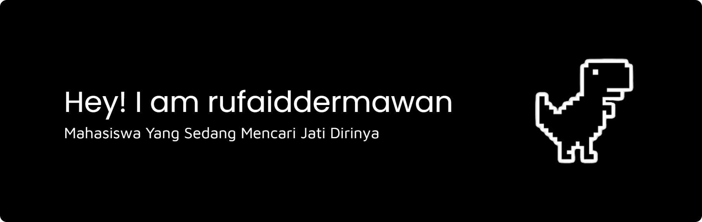

<!--
**rufaiddermawan/rufaiddermawan** is a ✨ _special_ ✨ repository because its `README.md` (this file) appears on your GitHub profile.

Here are some ideas to get you started:

- 🔭 I’m currently working on ...
- 🌱 I’m currently learning [**Laravel**](https)
- 👯 I’m looking to collaborate on ...
- 🤔 I’m looking for help with ...
- 💬 Ask me about ...
- 📫 How to reach me: ...
- 😄 Pronouns: ...
- ⚡ Fun fact: ...
-->
- 🔭 I am student of [**Bacharuddin Jusuf Habibie Institute of Technology**](https://ith.ac.id)
- 🌱 I’m currently learning [**Laravel**](https://laraver.com) Framework

<h1 align="left">Code With</h1>

###

  
  
  
  
  
  
  
  
  
  
  
  
  
  
  
  
  
  
  
  
  
  
  
  
  
  
  

###

  

  

  

###

<h2 align="left">Play Game With Me</h2>

###

<picture>
  <source media="(prefers-color-scheme: dark)" srcset="https://raw.githubusercontent.com/rufaiddermawan/rufaiddermawan/output/pacman-contribution-graph-dark.svg">
  <source media="(prefers-color-scheme: light)" srcset="https://raw.githubusercontent.com/rufaiddermawan/rufaiddermawan/output/pacman-contribution-graph.svg">
  
</picture>

###
